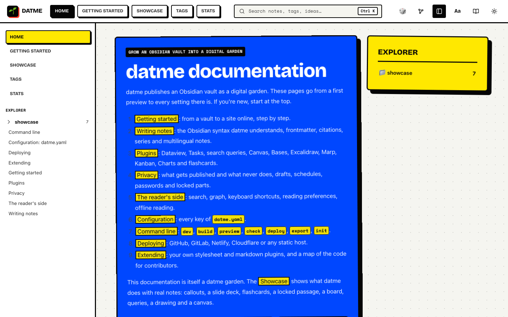
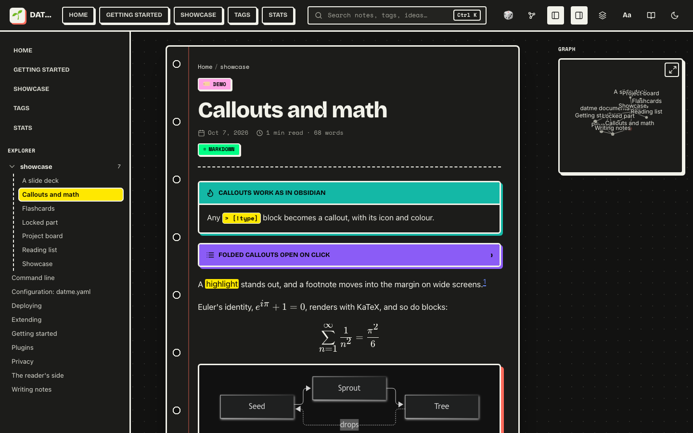
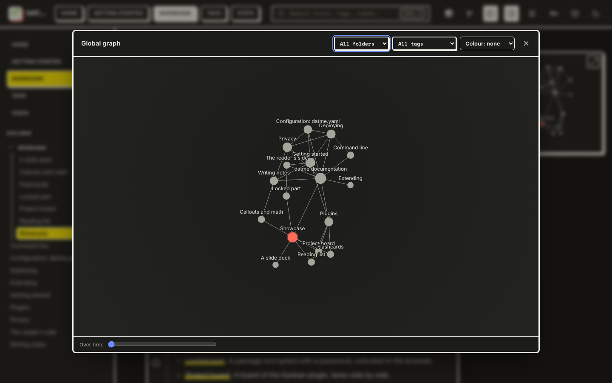
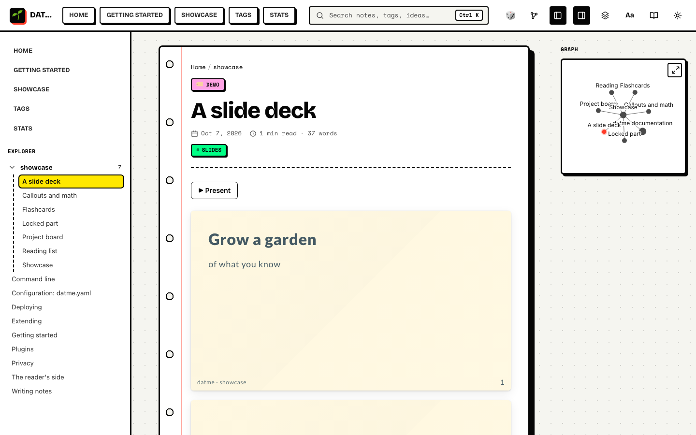
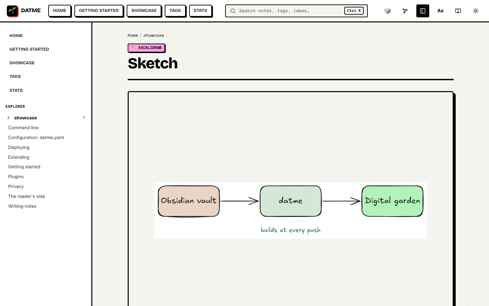

<p align="center">
  
</p>

<h1 align="center">datme</h1>

<p align="center">
  <em>Đất mẹ</em>, mother soil: the ground where the seeds of what you know take root and grow.
</p>

<p align="center">
  <a href="https://www.npmjs.com/package/@dynamotn/datme"></a>
  <a href="LICENSE"></a>
  
</p>

<p align="center">
  <a href="#quick-start">Quick start</a> ·
  <a href="#what-grows-in-it">Features</a> ·
  <a href="docs/README.md">Documentation</a> ·
  <a href="https://dynamo-tools.gitlab.io/datme">Live demo</a>
</p>

---

**datme turns an Obsidian vault into a digital garden.** Every note becomes an
index card pinned on a notebook wall, linked to everything around it by
backlinks, a living graph and full-text search. Point it at your vault and it
reads what you wrote the way Obsidian does: wikilinks, embeds, callouts,
Dataview queries, canvases, Excalidraw drawings, Marp decks. You don't have to
export anything or change a line.

```bash
bunx @dynamotn/datme dev ~/MyVault
```

<p align="center">
  
</p>

| | |
| --- | --- |
|  |  |
| A note in the dark theme, with its local graph | The global graph, filterable and replayable over time |
|  |  |
| A Marp deck, ready to present | An Excalidraw sketch, drawn from its scene |

The [documentation](docs/README.md) is itself a datme garden; its
[showcase](docs/showcase/Showcase.md) has a live example of each feature.

## Why datme

🌱 **Your vault, as it is.** No export step, no second copy of your notes. datme
understands Obsidian's syntax and the plugins people actually use, and renders
them at build time.

🔒 **Private by default.** Only notes that say `publish: true` leave the vault.
Everything else stays home, and so do the parts you lock with a password or
schedule for later.

🧭 **Made for wandering.** Readers can follow backlinks, open linked notes side
by side, hover a link to preview it, replay how the garden grew on the graph,
or jump to a random note.

⚡ **Fast, static, yours.** The output is plain HTML that any host can serve.
Builds are incremental (a 300-note vault rebuilds in about 2.5 s), pages work
offline, and one command sets up deployment to GitHub, GitLab, Netlify or
Cloudflare.

## Quick start

```bash
# 1. Write a commented datme.yaml into your vault (optional, every key has a default)
bunx @dynamotn/datme init ~/MyVault

# 2. Mark the notes to share with `publish: true` in their frontmatter, then preview
bunx @dynamotn/datme dev ~/MyVault          # http://localhost:4321, reloads as you write

# 3. Publish on every push
bunx @dynamotn/datme deploy github ~/MyVault   # or gitlab, netlify, cloudflare
```

`npx` works just as well with Node 23.6+. Install it globally with
`npm i -g @dynamotn/datme` and the command is simply `datme`.
[Getting started](docs/getting-started.md) walks through the rest.

## What grows in it

### Obsidian, faithfully

`[[wikilinks]]` and `![[embeds]]` of notes, headings, blocks, images and PDFs ·
callouts that fold · `==highlights==` · `%%comments%%` · tags · LaTeX ·
Mermaid · footnotes as margin sidenotes · BibTeX citations · line breaks kept
for poems.

### The plugins you rely on

| In your vault | On the site |
| --- | --- |
| **Dataview**, **Tasks** and `query` blocks | Run at build time, over published notes only |
| **Canvas** and **Bases** | Pannable canvas pages; base views as tables, cards and lists |
| **Excalidraw** | Drawn from the scene itself, hand-drawn lines and all, no export needed |
| **Marp Slides** | Slide decks with your themes, and a ▶ Present button for full screen |
| **Kanban** | Boards with their lanes side by side |
| **Charts** | Chart.js charts in the site's colours, with the data as a table too |
| **Spaced Repetition** | Flashcards, clozes and a practice mode that remembers progress |

### Made to be read

Notebook or quiet serif blog look, per folder · light and dark themes · reading
progress and time left · a reader menu for larger text, a legible font or high
contrast · links to an exact passage · lightbox for images and drawings ·
print stylesheet · right-to-left languages.

### Made to be explored

Search with folder, type and tag filters (`Ctrl K`) · a global graph coloured by
folder or type, with a time slider (`Ctrl G`) · stacked pages · related notes
and unlinked mentions · a glossary that links the first mention of each term ·
series · timeline, map and garden statistics · RSS for every folder and tag.

### Private where it matters

Whole notes or single passages encrypted with a password (AES-GCM, unlocked in
the browser) · drafts and scheduled notes · unlisted notes · only the assets a
published note uses get copied.

### Ready for the open web

Multilingual notes in one file · permalinks and redirects for old URLs · social
cards · JSON-LD · sitemap · `llms.txt` · webmentions and comments · an
installable offline app · dead links pointed at the Internet Archive · one-file
EPUB or printable export of any folder.

## Documentation

| | |
| --- | --- |
| [Getting started](docs/getting-started.md) | From a vault to a site online, step by step |
| [Writing notes](docs/writing.md) | Obsidian syntax, frontmatter, citations, series, languages |
| [Plugins](docs/plugins.md) | Dataview, Tasks, Canvas, Bases, Excalidraw, Marp, Kanban, Charts, flashcards |
| [Privacy](docs/privacy.md) | What gets published, drafts, schedules, passwords and locked parts |
| [The reader's side](docs/reading.md) | Search, graph, shortcuts, reading preferences, offline |
| [Configuration](docs/configuration.md) | Every key of `datme.yaml` |
| [Command line](docs/cli.md) | `dev`, `build`, `check`, `deploy`, `export` and their flags |
| [Deploying](docs/deploying.md) | GitHub, GitLab, Netlify, Cloudflare or any static host |
| [Extending](docs/extending.md) | Your own CSS, remark/rehype plugins, and hacking on datme |

## Contributing

```bash
bun install
bun run dev ~/MyVault   # same as `datme dev`
bun run check           # type-check
bun run test            # unit tests, end-to-end builds and accessibility checks
```

Issues and merge requests are welcome on
[GitLab](https://gitlab.com/dynamo-tools/datme). See [Extending](docs/extending.md#hacking-on-datme)
for a map of the code.

## License

[CC BY-SA 4.0](LICENSE): share and adapt freely, with attribution, under the
same license.
