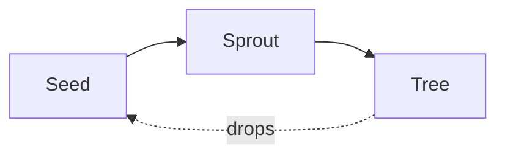

# Callouts and math

> [!tip] Callouts work as in Obsidian
> Any `> [!type]` block becomes a callout, with its icon and colour.

> [!example]- Folded callouts open on click
> A `-` after the type folds the callout.

A ==highlight== stands out, in ==🔴red==, ==🟠orange==, ==🟡yellow==,
==🟢green==, ==🔵blue== or ==🟣purple== too, and a footnote moves into the margin on wide
screens.[^luhmann]

Euler's identity, $e^{i\pi} + 1 = 0$, renders with KaTeX, and so do blocks:

$$
\sum_{n=1}^{\infty} \frac{1}{n^2} = \frac{\pi^2}{6}
$$



```ts title="garden.ts" {2}
const garden = await datme.build("~/Vault")
garden.publish() // this line is highlighted
```

[^luhmann]: Niklas Luhmann kept about 90,000 index cards in his slip box.
