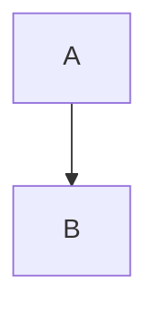

# Zettelkasten

> [!info] Definition
> A note-taking method made famous by [[Niklas Luhmann]].

## Definition
A slip box is ==a network of notes== linked to each other. ^core-idea

<!--lang:vi-VN-->
Ghi chú tiếng Việt chỉ có ở đây.
<!--lang:en-US-->
English-only paragraph.
<!--lang:*-->

> [!warning]- Folded caveat
> Hidden until opened.

## Related
Links: [[Missing note]], [[Private]], [[#Definition|jump]], #inline/tag and [the md link](../06_Reference/Niklas%20Luhmann.md).

%%a private comment%%

![[diagram.png|300]]

![[Flow.excalidraw]]

```js
const fake = "[[not a link]] ==not highlighted== #notatag"
```



$$
e^{i\pi} + 1 = 0
$$
